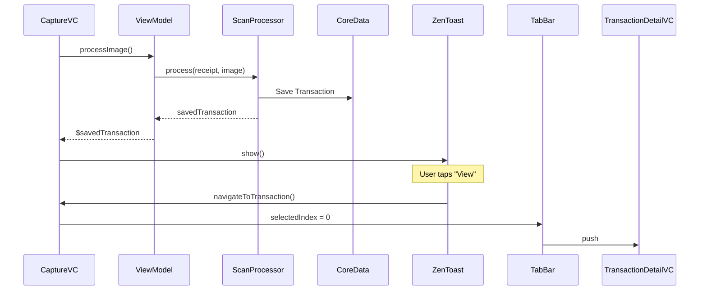

# Digital Receipt UI, Transaction Regeneration & Post-Scan Toast

**Date:** 2025-12-29
**Type:** Feature

## 1. Product & UX Context

### What Changed
- **Transactions List:** Now groups transactions by date ("Today", "Yesterday", "Dec 29, 2025") with merchant initial icons
- **Ticket Detail View:** Skeuomorphic receipt with jagged bottom edge, monospaced Menlo typography, and fake barcode
- **Settings Screen:** Sectioned layout with "My Accounts", "Merchants", and "About" groups
- **Post-Scan Toast:** Black capsule notification ("Receipt Saved" + "View" button) after successful scan
- **Regeneration Feature:** Re-analyze receipts with different AI models from the ticket detail menu

### Why
- Enhance the "Digital Zen" aesthetic with tactile, premium UI elements
- Improve discoverability of transactions with grouped date headers
- Enable users to quickly navigate to newly scanned receipts
- Allow re-processing receipts if the initial model produced inaccurate results

### Visuals
- Receipt view features thermal-printer styling with `Menlo` font family
- Jagged sawtooth bottom edge using `CAShapeLayer` + `UIBezierPath`
- ZenToast slides up from bottom with spring animation, auto-dismisses after 4s

## 2. Technical Implementation

### Key Changes
- **BaseViewController:** Unified navigation bar with `forceApplyNavigationBarStyle()` called in `viewWillAppear` to prevent ghost title bug
- **NSFetchedResultsController:** Transactions grouped by `sectionIdentifier` transient property
- **ZenToast:** Custom `UIView` with slide animation and navigation callback
- **Transaction Regeneration:** Re-runs OCR + LLM pipeline, updates existing Core Data entity in-place

### Tech Stack
- `CAShapeLayer` + `UIBezierPath` for receipt jagged edge
- `CGImageDestination` for HEIC image encoding (50% compression)
- Combine `@Published` properties for toast trigger

### Refactoring
- Forced Light Mode globally in `Info.plist` and `SceneDelegate`
- All main tabs (Transactions, Analytics, Settings) wrapped in `UINavigationController`
- Renamed `ScanRecord` struct to `ScanHistoryRecord` to avoid Core Data entity collision

## 3. Architecture & Data Models

### Schema Changes
- No new entities, but `ScanRecord.imagePath` now stores `.heic` instead of `.jpg`

### New Services/Modules
| File | Purpose |
|------|---------|
| `BaseViewController.swift` | Shared nav bar configuration |
| `ZenToast.swift` | Post-scan notification component |
| `ReceiptPath.swift` | Jagged/zigzag path generator |
| `ReceiptView.swift` | Skeuomorphic receipt renderer |
| `TransactionDetailViewController.swift` | Ticket detail with regeneration |

### Data Flow

## 4. Pending / Next Steps

### Technical Debt
- [ ] "Edit" button in ticket detail is placeholder only
- [ ] Analytics tab is placeholder content
- [ ] Categories screen in Settings just redirects to Merchants

### Known Issues
- ZenToast "View" navigation requires Modal Capture to be dismissed first
- Regeneration temporarily switches global model (could use isolated context instead)

### Future Enhancements
- Add swipe gestures on receipt view for quick actions
- Implement actual barcode generation (currently fake pattern)
- Add haptic feedback on toast appearance
